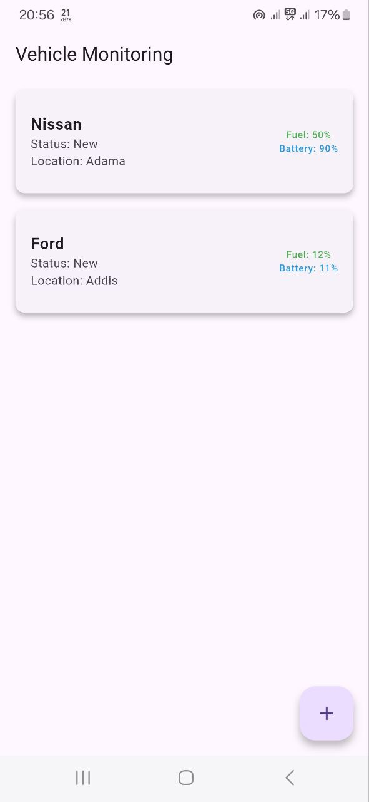
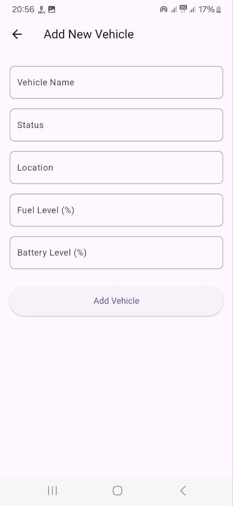
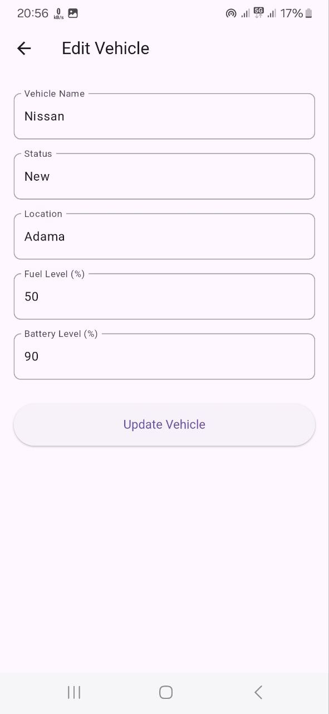

# Vehicle Monitoring App

## Overview

This is a simple Flutter-based app designed to monitor and manage vehicle data in real time. The app allows users to add, edit, and view vehicle details, including vehicle name, status, location, fuel level, and battery level. The app is connected to a Supabase backend for data storage and management.

## Features

- **View Vehicles**: List all vehicles with their details (name, status, location, fuel, and battery levels).
- **Add New Vehicle**: Add a new vehicle to the system with necessary details.
- **Edit Vehicle**: Update vehicle information, including name, status, location, fuel level, and battery level.

## Tech Stack

- **Flutter**: The framework used for building the cross-platform app.
- **Supabase**: A backend-as-a-service platform used for managing data and authentication.

## Setup Instructions

To get the app running on your local machine or emulator, follow the instructions below.

### Prerequisites

- Install [Flutter](https://flutter.dev/docs/get-started/install) on your machine.
- Set up a [Supabase accountZ(https://supabase.io) and configure your project.

### Installation

1. Clone the repository:

   ```bash
   git clone https://github.com/yourusername/vehicle-monitoring-app.git
   cd vehicle-monitoring-app

2. Install dependencies:

   ```bash
   flutter pub get

3. Configure Supabase:
   
   Add your Supabase project URL and API key to your app. You can do this by updating the lib/services.dart file with the appropriate details.

5. Run the app on an emulator or device:

   ```bash
   flutter run

You can download the APK for the app from the link below:

[Download APK](https://drive.google.com/file/d/13DMvViizfdYSIFcYqw9JeqLlV4loAiUC/view?usp=drive_link)

### Screenshots
Here are some screenshots of the app: 
<p>
  
  
  
</p>
   
